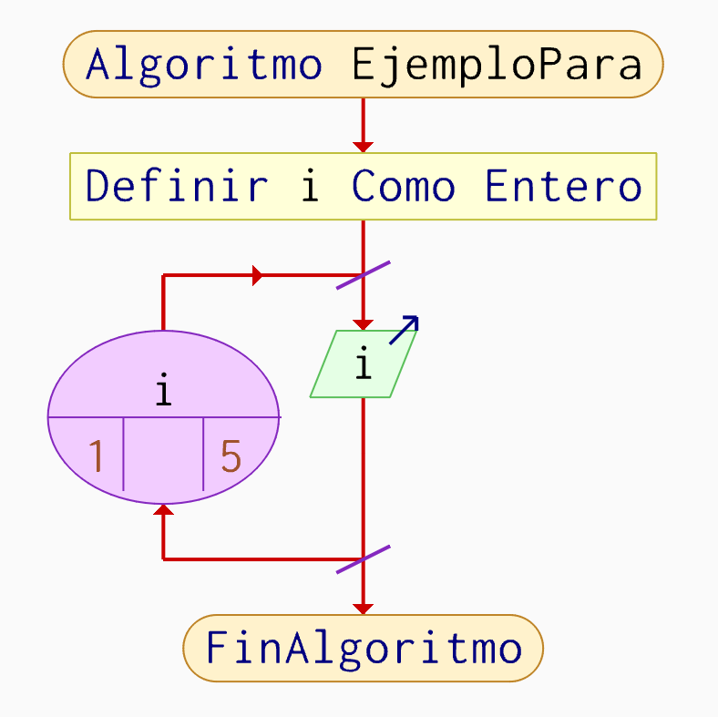
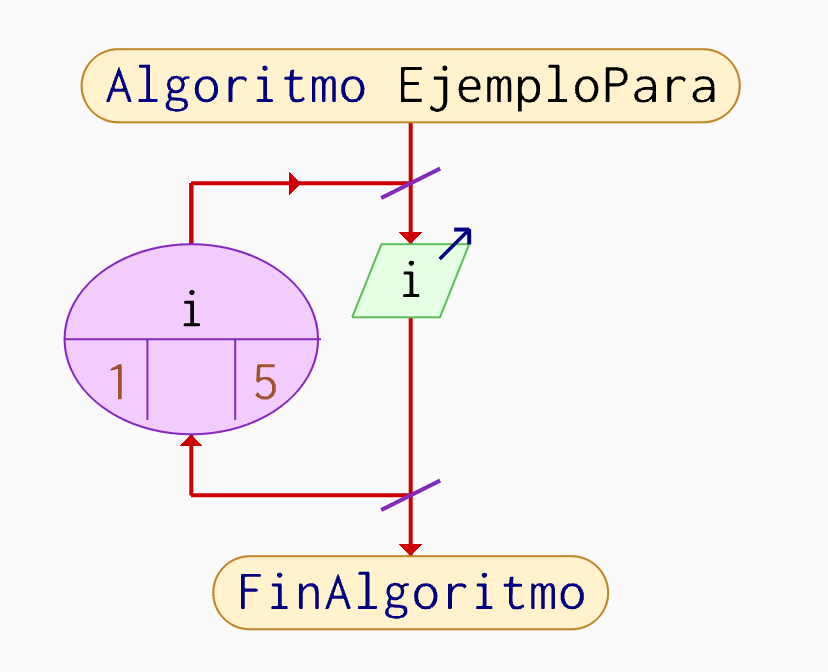
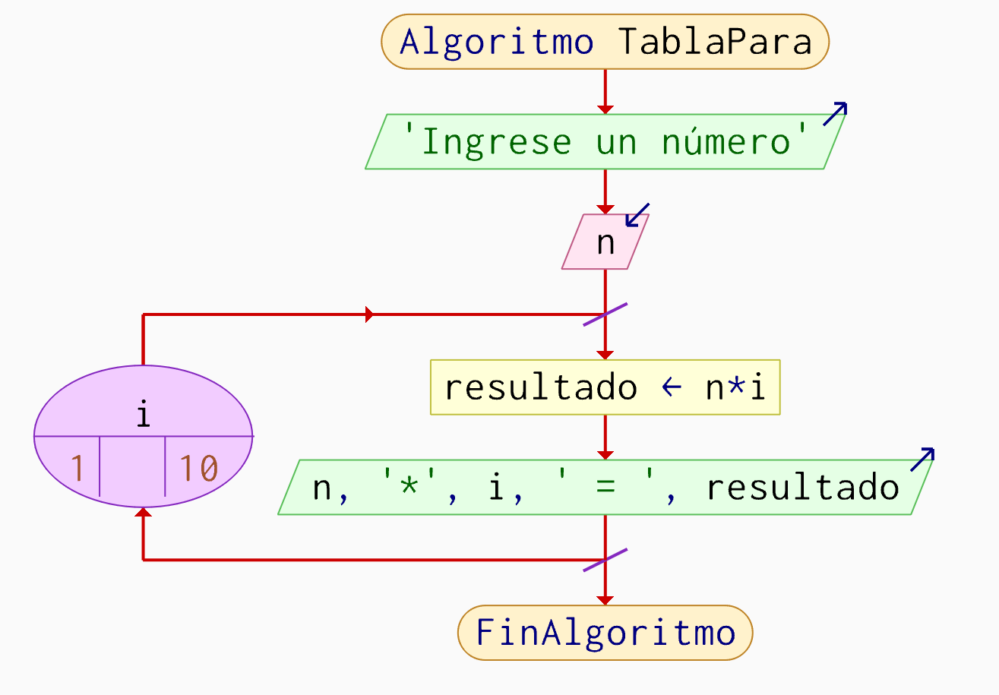
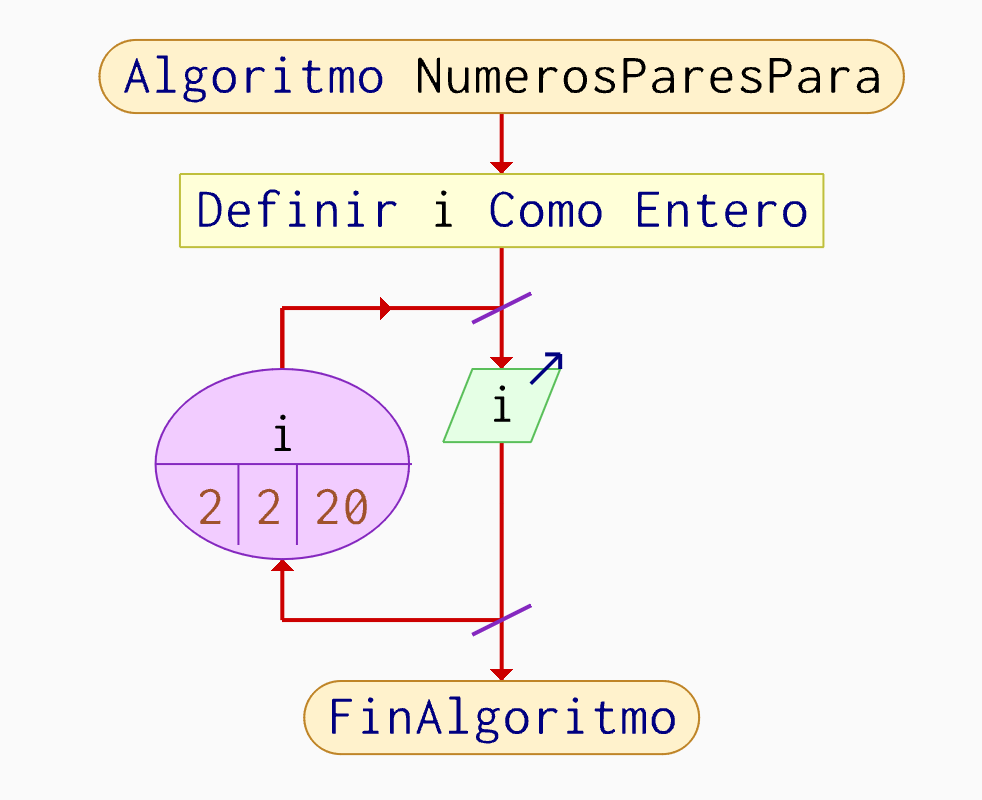
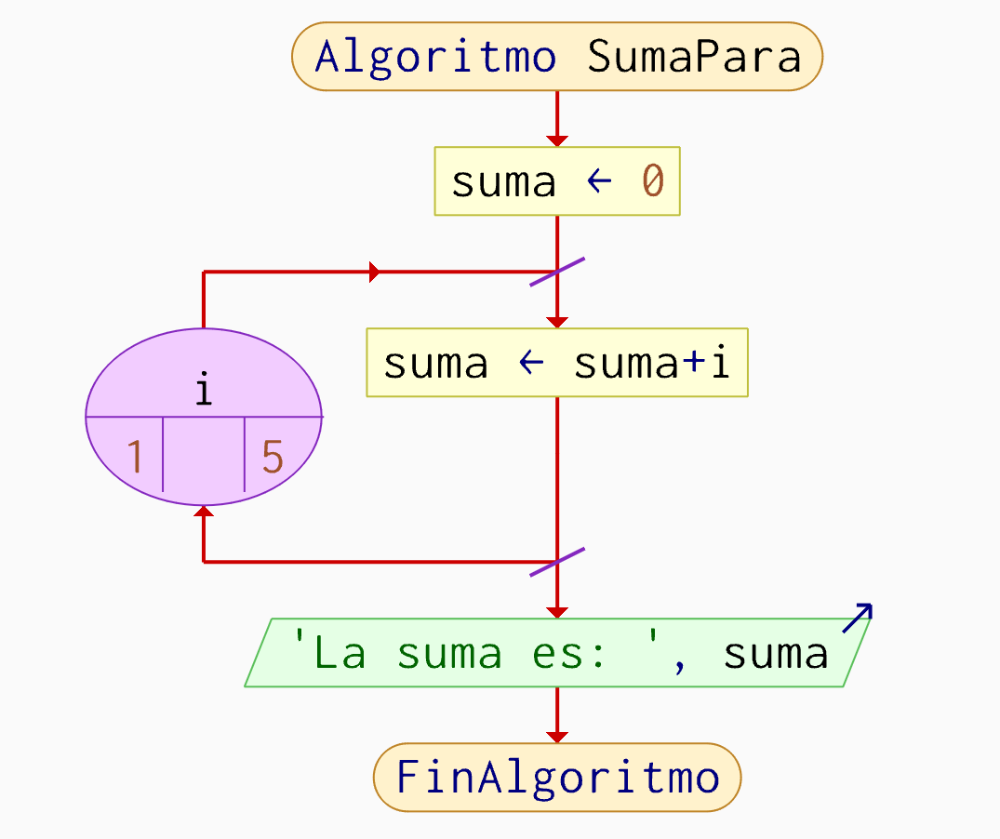
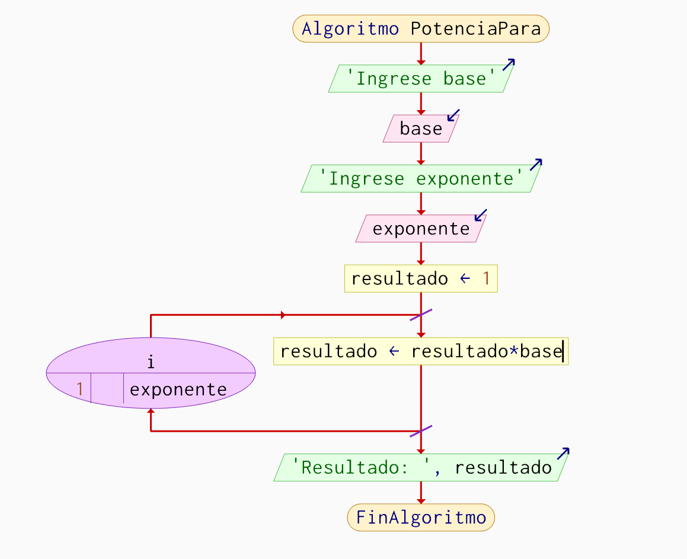

# Ciclo Para en PSeInt

---

# 1. Introducción

El ciclo Para es una estructura repetitiva utilizada
cuando se conoce previamente la cantidad de repeticiones
que debe ejecutar un algoritmo.

Esta estructura permite automatizar procesos repetitivos
de manera organizada y sencilla.

El ciclo Para controla automáticamente:

- valor inicial,
- valor final,
- incremento.

En programación, esta estructura es ampliamente utilizada
para recorridos, cálculos matemáticos, tablas y procesos
iterativos.

---

# 2. ¿Qué es un ciclo Para?

El ciclo Para es una estructura repetitiva que ejecuta
un bloque de instrucciones un número determinado de veces.

A diferencia del ciclo Mientras, el ciclo Para ya incluye:

- inicialización,
- condición,
- incremento.

La estructura general funciona así:

1. Se define una variable de control.
2. Se establece un valor inicial.
3. Se define un valor final.
4. El ciclo ejecuta instrucciones automáticamente.
5. La variable aumenta progresivamente.
6. El ciclo termina al alcanzar el límite establecido.

Esta estructura es utilizada en:

- Tablas de multiplicar
- Recorridos numéricos
- Operaciones matemáticas
- Procesamiento de datos
- Algoritmos iterativos

---

# 3. Sintaxis

```pseint
Para variable = inicio Hasta fin Hacer

    instrucciones

FinPara
```

## Ejemplo básico

```pseint
Algoritmo EjemploPara

    Definir i Como Entero

    Para i = 1 Hasta 5 Hacer

        Escribir i

    FinPara

FinAlgoritmo
```

---

# 4. Diagrama general del ciclo Para

El ciclo Para sigue una estructura repetitiva controlada.

1. Inicialización
2. Evaluación del límite
3. Ejecución de instrucciones
4. Incremento automático
5. Repetición



---

# 5. Ejercicio Resuelto 1

## 5.1 Enunciado

# Ejercicio 1 - Contador del 1 al 10

## Enunciado

Realizar un algoritmo en PSeInt que muestre los números
del 1 al 10 utilizando un ciclo Para.

---

## 5.2 Análisis

El problema requiere mostrar números consecutivos.

Para resolverlo se utilizará:

- una variable de control,
- un ciclo repetitivo,
- incremento automático.

El algoritmo debe:

1. Inicializar la variable en 1.
2. Mostrar el valor actual.
3. Repetir hasta llegar a 10.

---

## 5.3 Variables

| Variable | Tipo | Descripción |
|----------|----------|--------------|
| i | Entero | Controla la repetición |

---

## 5.4 Código comentado

```pseint
Algoritmo ContadorPara

    Para i = 1 Hasta 10 Hacer

        // Mostrar número actual
        Escribir i

    FinPara

FinAlgoritmo
```

---

## 5.5 Diagrama de flujo



---

## 5.6 Explicación paso a paso

### Paso 1
La variable i inicia en 1.

### Paso 2
El ciclo ejecuta automáticamente las repeticiones.

### Paso 3
Se muestra el valor actual de i.

### Paso 4
El ciclo incrementa automáticamente la variable.

### Paso 5
El proceso termina cuando i supera el valor 10.

---

## 5.7 Resultado esperado

```txt
1
2
3
4
5
6
7
8
9
10
```

---

# 6. Ejercicio Resuelto 2

## 6.1 Enunciado

# Ejercicio 2 - Tabla de multiplicar

## Enunciado

Realizar un algoritmo en PSeInt que solicite un número
y muestre su tabla de multiplicar del 1 al 10
utilizando un ciclo Para.

---

## 6.2 Análisis

El algoritmo requiere realizar multiplicaciones repetitivas.

Se utilizará:

- una variable numérica,
- una variable de control,
- un ciclo Para.

El algoritmo debe:

1. Solicitar un número.
2. Recorrer del 1 al 10.
3. Multiplicar.
4. Mostrar resultados.

---

## 6.3 Variables

| Variable | Tipo | Descripción |
|----------|----------|--------------|
| n | Entero | Número ingresado |
| i | Entero | Controla la repetición |
| resultado | Entero | Guarda la multiplicación |

---

## 6.4 Código comentado

```pseint
Algoritmo TablaPara

    Escribir "Ingrese un número"
    Leer n

    Para i = 1 Hasta 10 Hacer

        resultado = n * i

        Escribir n, " x ", i, " = ", resultado

    FinPara

FinAlgoritmo
```

---

## 6.5 Diagrama de flujo



---

## 6.6 Explicación paso a paso

### Paso 1
El usuario ingresa un número.

### Paso 2
El ciclo inicia en 1.

### Paso 3
Se realiza la multiplicación.

### Paso 4
El resultado se muestra en pantalla.

### Paso 5
El ciclo continúa hasta llegar a 10.

---

## 6.7 Resultado esperado

```txt
Ingrese un número
5

5 x 1 = 5
5 x 2 = 10
5 x 3 = 15
5 x 4 = 20
5 x 5 = 25
5 x 6 = 30
5 x 7 = 35
5 x 8 = 40
5 x 9 = 45
5 x 10 = 50
```

---

# 7. Ejercicio Resuelto 3

## 7.1 Enunciado

# Ejercicio 3 - Números pares

## Enunciado

Realizar un algoritmo que muestre los números pares
del 2 al 20 utilizando un ciclo Para.

---

## 7.2 Análisis

El algoritmo debe recorrer números consecutivos
e identificar los pares.

---

## 7.3 Variables

| Variable | Tipo | Descripción |
|----------|----------|--------------|
| i | Entero | Controla la repetición |

---

## 7.4 Código comentado

```pseint
Algoritmo NumerosParesPara

    Para i = 2 Hasta 20 Con Paso 2 Hacer

        Escribir i

    FinPara

FinAlgoritmo
```

---

## 7.5 Diagrama de flujo



---

## 7.6 Explicación paso a paso

### Paso 1
El ciclo inicia en 2.

### Paso 2
El incremento ocurre de dos en dos.

### Paso 3
Se muestran únicamente números pares.

### Paso 4
El ciclo termina al llegar a 20.

---

## 7.7 Resultado esperado

```txt
2
4
6
8
10
12
14
16
18
20
```

---

# 8. Ejercicio Resuelto 4

## 8.1 Enunciado

# Ejercicio 4 - Suma acumulativa

## Enunciado

Realizar un algoritmo que sume los números del 1 al 5
utilizando un ciclo Para.

---

## 8.2 Análisis

El algoritmo debe acumular valores numéricos
progresivamente.

---

## 8.3 Variables

| Variable | Tipo | Descripción |
|----------|----------|--------------|
| i | Entero | Controla la repetición |
| suma | Entero | Acumula valores |

---

## 8.4 Código comentado

```pseint
Algoritmo SumaPara

    suma = 0

    Para i = 1 Hasta 5 Hacer

        suma = suma + i

    FinPara

    Escribir "La suma es: ", suma

FinAlgoritmo
```

---

## 8.5 Diagrama de flujo



---

## 8.6 Explicación paso a paso

### Paso 1
La variable suma inicia en 0.

### Paso 2
El ciclo recorre del 1 al 5.

### Paso 3
Cada valor se acumula progresivamente.

### Paso 4
Al finalizar, se muestra la suma total.

---

## 8.7 Resultado esperado

```txt
La suma es: 15
```

---

# 9. Ejercicio Resuelto 5

## 9.1 Enunciado

# Ejercicio 5 - Potencias

## Enunciado

Realizar un algoritmo que calcule la potencia
de un número utilizando un ciclo Para.

---

## 9.2 Análisis

El algoritmo debe multiplicar repetidamente
un número por sí mismo.

---

## 9.3 Variables

| Variable | Tipo | Descripción |
|----------|----------|--------------|
| base | Entero | Número base |
| exponente | Entero | Número de repeticiones |
| resultado | Entero | Guarda el resultado |
| i | Entero | Controla la repetición |

---

## 9.4 Código comentado

```pseint
Algoritmo PotenciaPara

    Escribir "Ingrese base"
    Leer base

    Escribir "Ingrese exponente"
    Leer exponente

    resultado = 1

    Para i = 1 Hasta exponente Hacer

        resultado = resultado * base

    FinPara

    Escribir "Resultado: ", resultado

FinAlgoritmo
```

---

## 9.5 Diagrama de flujo



---

## 9.6 Explicación paso a paso

### Paso 1
El usuario ingresa base y exponente.

### Paso 2
La variable resultado inicia en 1.

### Paso 3
El ciclo multiplica repetidamente.

### Paso 4
El resultado final se muestra en pantalla.

---

## 9.7 Resultado esperado

```txt
Ingrese base
2

Ingrese exponente
4

Resultado: 16
```

---

# 10. Ejercicios Propuestos

---

## 10.1 Ejercicio Propuesto 1

## Enunciado

Realizar un algoritmo que calcule el factorial
de un número utilizando un ciclo Para.

---

## 10.2 Ejercicio Propuesto 2

## Enunciado

Realizar un algoritmo que muestre la secuencia
de Fibonacci utilizando un ciclo Para.

---

## 10.3 Ejercicio Propuesto 3

## Enunciado

Realizar un algoritmo que muestre los divisores
de un número utilizando un ciclo Para.

---

## 10.4 Ejercicio Propuesto 4

## Enunciado

Realizar un algoritmo que determine si un número
es primo utilizando un ciclo Para.

---

## 10.5 Ejercicio Propuesto 5

## Enunciado

Realizar un algoritmo que muestre los múltiplos
de 5 desde 1 hasta 100 utilizando un ciclo Para.