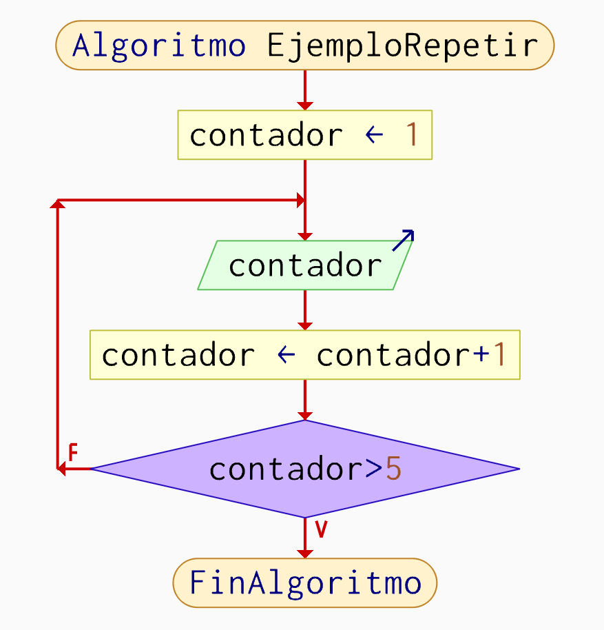
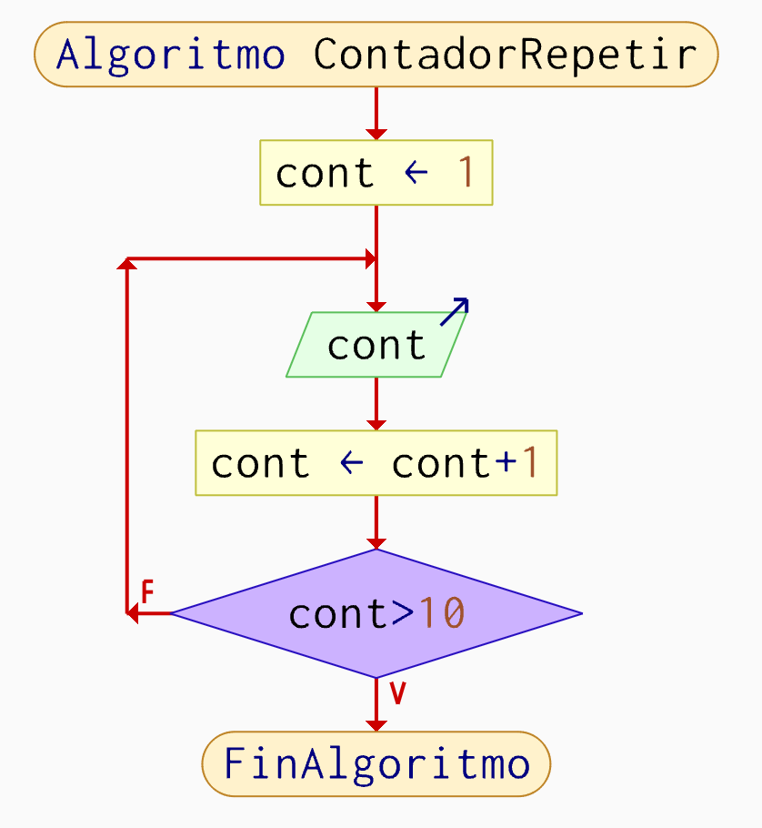
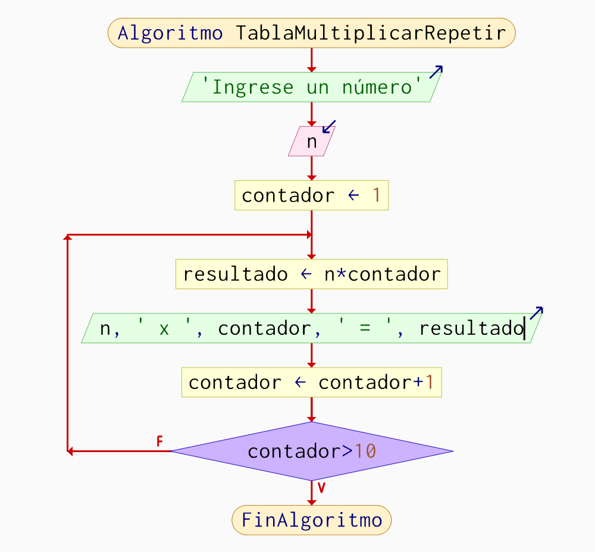
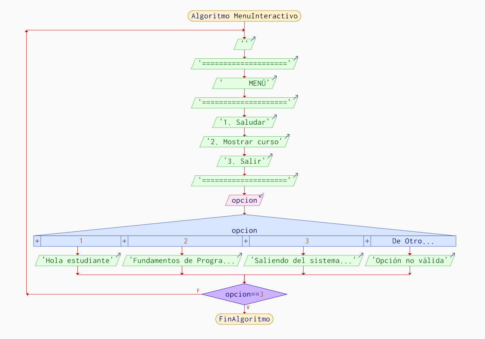

# Ciclo Repetir en PSeInt

---

# 1. Introducción

El ciclo Repetir es una estructura repetitiva utilizada
cuando se necesita ejecutar un bloque de instrucciones
al menos una vez antes de evaluar una condición.

A diferencia del ciclo Mientras, donde la condición se
evalúa al inicio, el ciclo Repetir ejecuta primero las
instrucciones y luego verifica si debe continuar o finalizar.

Esta característica lo convierte en una excelente opción
para procesos de validación de datos, menús interactivos
y programas que requieren interacción con el usuario.

En programación, el ciclo Repetir es ampliamente utilizado
para garantizar que ciertas instrucciones se ejecuten al menos
una vez independientemente del resultado de la condición.

---

# 2. ¿Qué es un ciclo Repetir?

El ciclo Repetir es una estructura de control repetitiva
que ejecuta un bloque de instrucciones y posteriormente
evalúa una condición lógica.

La estructura general funciona así:

1. Ejecuta las instrucciones.
2. Evalúa la condición.
3. Si la condición es falsa, repite.
4. Si la condición es verdadera, finaliza.

Esta estructura es ampliamente utilizada en:

- Validación de datos.
- Menús interactivos.
- Juegos.
- Sistemas de autenticación.
- Captura de información.
- Aplicaciones de escritorio.

---

# 3. Sintaxis

```pseint
Repetir

    instrucciones

Hasta Que condicion
```

## Ejemplo básico

```pseint
Algoritmo EjemploRepetir

    contador = 1

    Repetir

        Escribir contador

        contador = contador + 1

    Hasta Que contador > 5

FinAlgoritmo
```

---

# 4. Diagrama general del ciclo Repetir

El ciclo Repetir sigue una estructura lógica repetitiva.

1. Inicialización.
2. Ejecución de instrucciones.
3. Evaluación de condición.
4. Repetición.
5. Finalización.



---

# 5. Ejercicio Resuelto 1

## 5.1 Enunciado

# Ejercicio 1 - Contador del 1 al 10

## Enunciado

Realizar un algoritmo en PSeInt que muestre los números
del 1 al 10 utilizando un ciclo Repetir.

---

## 5.2 Análisis

El problema requiere mostrar números consecutivos.

Para resolverlo se utilizará:

- una variable contador,
- una condición lógica,
- un incremento progresivo.

El algoritmo debe:

1. Inicializar el contador en 1.
2. Mostrar el valor actual.
3. Incrementar el contador.
4. Repetir el proceso hasta llegar a 10.

---

## 5.3 Variables

| Variable | Tipo | Descripción |
|----------|----------|--------------|
| cont | Entero | Controla la repetición |

---

## 5.4 Código comentado

```pseint
Algoritmo ContadorRepetir

    // Inicialización
    cont = 1

    // Ciclo repetitivo
    Repetir

        // Mostrar número actual
        Escribir cont

        // Incrementar contador
        cont = cont + 1

    Hasta Que cont > 10

FinAlgoritmo
```

---

## 5.5 Diagrama de flujo



---

## 5.6 Explicación paso a paso

### Paso 1

La variable cont inicia en 1.

### Paso 2

El ciclo ejecuta las instrucciones.

```pseint
Escribir cont
```

### Paso 3

El contador aumenta en una unidad.

```pseint
cont = cont + 1
```

### Paso 4

Se evalúa la condición.

```pseint
cont > 10
```

### Paso 5

Mientras la condición sea falsa, el ciclo continúa.

### Paso 6

Cuando la condición sea verdadera, el ciclo termina.

---

## 5.7 Resultado esperado

```txt
1
2
3
4
5
6
7
8
9
10
```
---

# 6. Ejercicio Resuelto 2

## 6.1 Enunciado

# Ejercicio 2 - Tabla de multiplicar

## Enunciado

Realizar un algoritmo en PSeInt que solicite un número
al usuario y muestre su tabla de multiplicar del 1 al 10
utilizando un ciclo Repetir.

---

## 6.2 Análisis

El problema requiere realizar una operación repetitiva.

Para resolverlo se utilizará:

- una variable numérica,
- una variable contador,
- una variable resultado,
- un ciclo Repetir.

El algoritmo debe:

1. Solicitar un número.
2. Inicializar contador en 1.
3. Multiplicar el número por el contador.
4. Mostrar el resultado.
5. Incrementar el contador.
6. Repetir hasta llegar a 10.

---

## 6.3 Variables

| Variable | Tipo | Descripción |
|----------|----------|--------------|
| n | Entero | Número ingresado |
| contador | Entero | Controla la repetición |
| resultado | Entero | Guarda la multiplicación |

---

## 6.4 Código comentado

```pseint
Algoritmo TablaMultiplicarRepetir

    // Solicitar número
    Escribir "Ingrese un número"
    Leer n

    // Inicialización
    contador = 1

    // Ciclo repetitivo
    Repetir

        // Multiplicación
        resultado = n * contador

        // Mostrar resultado
        Escribir n, " x ", contador, " = ", resultado

        // Incrementar contador
        contador = contador + 1

    Hasta Que contador > 10

FinAlgoritmo
```

---

## 6.5 Diagrama de flujo



---

## 6.6 Explicación paso a paso

### Paso 1

El usuario ingresa un número.

### Paso 2

La variable contador inicia en 1.

### Paso 3

Se calcula la multiplicación.

```pseint
resultado = n * contador
```

### Paso 4

Se muestra el resultado.

### Paso 5

El contador aumenta.

```pseint
contador = contador + 1
```

### Paso 6

El ciclo termina cuando:

```pseint
contador > 10
```

---

## 6.7 Resultado esperado

```txt
Ingrese un número
5

5 x 1 = 5
5 x 2 = 10
5 x 3 = 15
5 x 4 = 20
5 x 5 = 25
5 x 6 = 30
5 x 7 = 35
5 x 8 = 40
5 x 9 = 45
5 x 10 = 50
```
---

# 7. Ejercicio Resuelto 5

## 7.1 Enunciado

# Ejercicio 5 - Menú Interactivo

## Enunciado

Realizar un algoritmo en PSeInt que muestre un menú
interactivo con las siguientes opciones:

1. Saludar
2. Mostrar nombre del curso
3. Salir

El menú debe repetirse hasta que el usuario seleccione
la opción Salir.

---

## 7.2 Análisis

Este problema es ideal para el ciclo Repetir porque
el menú debe mostrarse al menos una vez.

Para resolverlo se utilizará:

- una variable opción,
- una estructura condicional,
- un ciclo Repetir.

El algoritmo debe:

1. Mostrar el menú.
2. Solicitar una opción.
3. Ejecutar la acción correspondiente.
4. Repetir mientras la opción sea diferente de 3.

---

## 7.3 Variables

| Variable | Tipo | Descripción |
|----------|----------|--------------|
| opcion | Entero | Almacena la opción seleccionada |

---

## 7.4 Código comentado

```pseint
Algoritmo MenuInteractivo

    // Variable de control
    Definir opcion Como Entero

    // Ciclo repetitivo
    Repetir

        // Mostrar menú
        Escribir ""
        Escribir "===================="
        Escribir "      MENÚ"
        Escribir "===================="
        Escribir "1. Saludar"
        Escribir "2. Mostrar curso"
        Escribir "3. Salir"
        Escribir "===================="

        // Leer opción
        Leer opcion

        // Procesar opción
        Segun opcion Hacer

            1:
                Escribir "Hola estudiante"

            2:
                Escribir "Fundamentos de Programación con PSeInt"

            3:
                Escribir "Saliendo del sistema..."

            De Otro Modo:
                Escribir "Opción no válida"

        FinSegun

    Hasta Que opcion == 3

FinAlgoritmo
```

---

## 7.5 Diagrama de flujo



---

## 7.6 Explicación paso a paso

### Paso 1

El menú se muestra al usuario.

### Paso 2

El usuario selecciona una opción.

### Paso 3

La estructura Segun ejecuta la acción correspondiente.

### Paso 4

Si la opción es diferente de 3,
el ciclo vuelve a mostrar el menú.

### Paso 5

Cuando el usuario selecciona la opción 3,
la condición se cumple.

```pseint
opcion == 3
```

### Paso 6

El ciclo finaliza y el programa termina.

---

## 7.7 Resultado esperado

```txt
====================
      MENÚ
====================
1. Saludar
2. Mostrar curso
3. Salir
====================

1

Hola estudiante

====================
      MENÚ
====================
1. Saludar
2. Mostrar curso
3. Salir
====================

2

Fundamentos de Programación con PSeInt

====================
      MENÚ
====================
1. Saludar
2. Mostrar curso
3. Salir
====================

3

Saliendo del sistema...
```